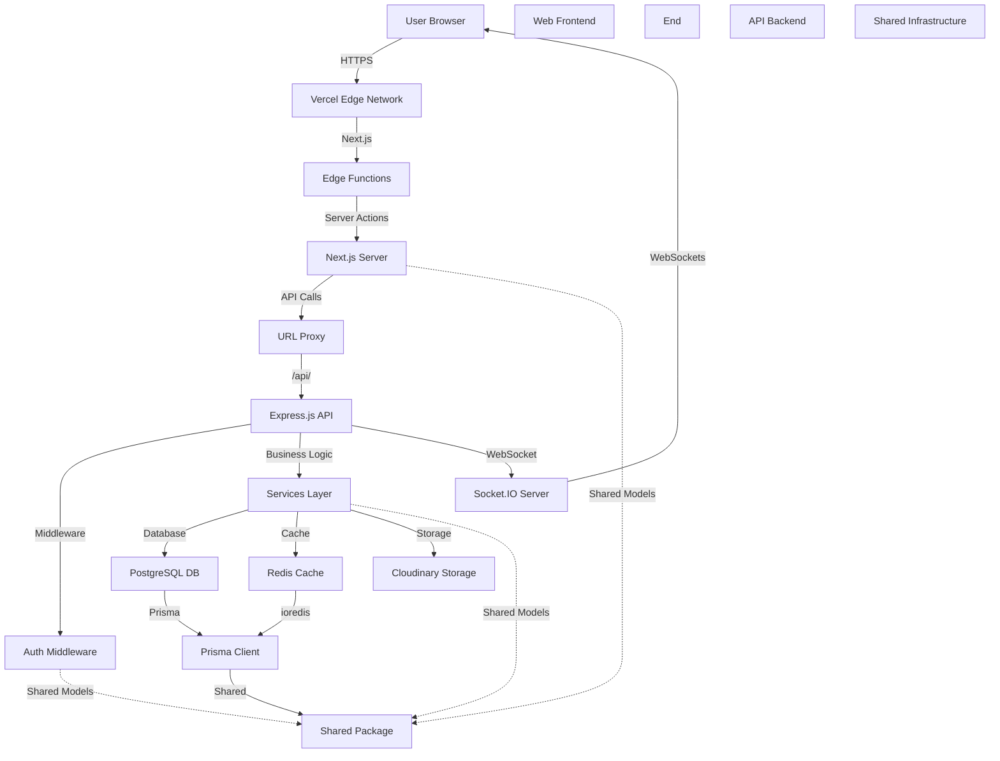

# FredoCloud — Goal & Task Management Platform

> Real-time productivity hub with visual goal tracking, intelligent prioritization, and automated analytics.


---

## 📋 Table of Contents

- [🎯 Project Overview](#-project-overview)
- [✨ Key Features](#-key-features)
- [🏗️ Architecture](#-architecture)
- [🚀 Getting Started](#-getting-started)
- [📂 Project Structure](#-project-structure)
- [🛠️ Tech Stack](#️-tech-stack)
- [📝 Database Schema](#-database-schema)
- [🗄️ Prisma Setup](#️-prisma-setup)
- [🗂️ API Documentation](#-api-documentation)
- [📊 Analytics & Reporting](#-analytics--reporting)
- [🔄 Real-time Sync](#-real-time-sync)
- [🔒 Authentication](#-authentication)
- [🎨 UI/UX Design](#-uiux-design)
- [📡 Deployment](#-deployment)
- [🧪 Testing](#-testing)
- [📈 Performance](#-performance)
- [🧩 Extensibility](#-extensibility)
- [ troubleshooting](#-troubleshooting)

---

## 🎯 Project Overview

**FredoCloud** is a comprehensive goal and task management platform designed to help individuals and teams achieve their objectives through visual tracking, intelligent prioritization, and seamless collaboration. The platform combines a modern, responsive web interface with a powerful, real-time backend to deliver an exceptional productivity experience.

---

## ✨ Key Features

### ✅ Visual Goal Management
- **Hierarchical Goal Structure**: Organize goals into parent-child relationships for better clarity
- **Visual Goal Cards**: Interactive cards showing progress, status, and deadlines
- **Milestone Tracking**: Break down goals into manageable milestones with individual tracking
- **Progress Visualization**: Real-time progress bars and completion percentages

### ✅ Intelligent Task Management
- **Smart Categorization**: Automatically categorize tasks using AI-powered natural language understanding
- **Priority Prediction**: AI suggests optimal priority levels based on task characteristics
- **Due Date Prediction**: Predicts realistic due dates using historical data
- **Smart Sorting**: Automatically sorts tasks by importance, urgency, and effort

### ✅ Real-time Collaboration
- **Live Updates**: Instant synchronization of goal and task changes across all devices
- **Real-time Notifications**: Instant alerts for updates, mentions, and task completions
- **Online Presence**: See who's online and working on what in real-time
- **Team Dashboards**: Collaborative workspaces for team goal tracking

### ✅ Advanced Analytics
- **AI-Powered Insights**: Natural language explanations of trends and patterns
- **Visual Analytics**: Comprehensive charts and graphs powered by Recharts
- **Completion Analytics**: Track goal completion rates over time
- **Progress Analytics**: Monitor individual and team progress
- **Audit Trails**: Complete audit logs for all changes with detailed change tracking
- **Data Export**: Export workspace data and audit logs to CSV format

### ✅ User Experience
- **Dark Mode**: Built-in dark mode support with automatic theme switching
- **Responsive Design**: Seamless experience across desktop, tablet, and mobile devices
- **Keyboard Shortcuts**: Enhanced keyboard navigation for power users
- **Accessibility**: ARIA labels and keyboard navigation support
- **User Onboarding**: Step-by-step guided setup for new users

### ✅ Productivity Tools
- **Quick Capture**: Instant task creation with natural language input
- **Smart Reminders**: Context-aware notifications and reminders
- **Time Tracking**: Track time spent on tasks and goals
- **Streak Tracking**: Visual streaks for consecutive days of productivity

### ✅ Workspace Management
- **Multi-Workspace Support**: Manage multiple workspaces independently
- **Member Management**: Add, remove, and manage workspace members
- **Role-Based Access**: Role-based permissions for workspace members
- **Workspace Analytics**: Track workspace-wide productivity metrics
- **Settings Management**: Configure workspace-specific settings

---

## 🏗️ Architecture

### Monorepo Structure

The project follows a **Turborepo monorepo** architecture for optimal code sharing and development efficiency:

```
fredocloud/
├── apps/
│   ├── web/        # Next.js frontend (React)
│   └── api/        # Express.js backend (Node.js)
├── packages/
│   └── shared/     # Shared code (constants, types, validators)
├── prisma/         # Prisma schema (shared across apps)
├── .github/        # GitHub Actions CI/CD pipelines
├── .claude/        # Claude AI coding guidelines
├── README.md
└── package.json
```

### Component Diagram



### Technical Architecture

- **Frontend**: Next.js with App Router, React, Recharts, Tailwind CSS
- **Backend**: Express.js with TypeScript, Socket.IO, Prisma
- **Database**: PostgreSQL (hosted on Railway)
- **Cache**: Redis (hosted on Railway)
- **Real-time**: Socket.IO with Redis adapter for multi-server support
- **File Storage**: Cloudinary for image and document uploads
- **Deployment**: Vercel (frontend), Railway (backend)

---

## 🚀 Getting Started

### Prerequisites

- **Node.js**: v20.x or higher
- **PostgreSQL**: v15 or higher
- **Redis**: v7 or higher
- **npm** or **yarn**

### Installation

1. **Clone the repository**
```bash
git clone <repository-url>
cd fredocloud
```

2. **Install dependencies**
```bash
npm install
```

3. **Configure environment variables**
```bash
cp apps/api/.env.example apps/api/.env
cp apps/web/.env.local.example apps/web/.env.local
```

Update the `.env` and `.env.local` files with your actual database credentials, API keys, and configuration.

4. **Apply database migrations**
```bash
npm run db:migrate
```